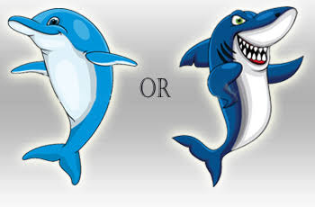

# Anni's Spass Fakten

---?image=hai.jpg

## Haie

- Scharfe Zähne
- Skelette aus Knorpel

---?image=dolphin.jpg

## Delfine

- Können nicht unter Wasser atmen, weil Sie Lungen haben (wie Menschen)
- Gehen nicht zu tief unter Wasser

---

## Jokes

+++
Was unter Wasser ist wie ein Stern?
+++?image=starfish.jpg
Ein Seestern

+++
Was unter Wasser ist wie ein Regenbogen?
+++?image=clownfish.jpg
Clownfisch

+++
Was ist ist unter Wasser wie Wackelpudding?
+++?image=octopus.jpg
Ein Octopus

+++
Was ist unter Wasser weiss wie Schnee?
+++?image=shark.jpg
Der grosse, weisse Hai

+++
Welcher Fisch hat eine Lampe?
+++?image=anglerfish.png
Der Seeteufel
